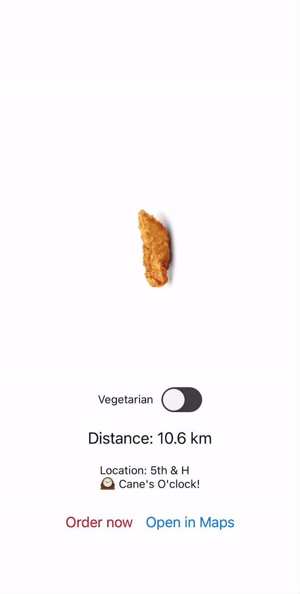

# Demo

# Setup
Hosted on Snack: https://snack.expo.dev/@ndelafuente/onelove

Requires a mobile device to use the magnetometer.
1. Download Expo Go on your device (https://expo.dev/go)
2. Scan the following QR code with your device (if reading this on an iOS device, you can also long-press the image and tap "Open in Expo Go")

