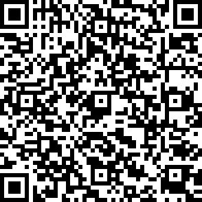

# Setup
Hosted on Snack: https://snack.expo.dev/@ndelafuente/onelove

Requires a mobile device to use the magnetometer.
1. Download Expo Go on your device (https://expo.dev/go)
2. Scan the following QR code with your device, or click [here](exp://u.expo.dev/933fd9c0-1666-11e7-afca-d980795c5824?runtime-version=exposdk%3A50.0.0&channel-name=production&snack=%40ndelafuente%2Fonelove&snack-channel=lXjuatb18e)

